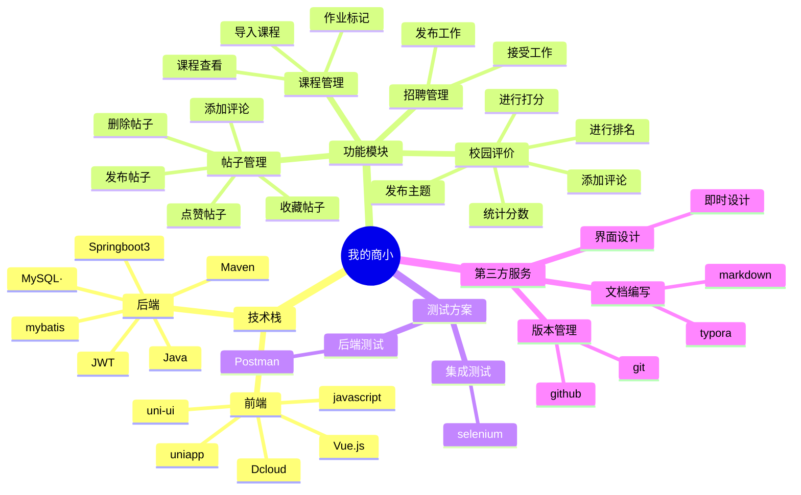

# 我的商小

## 项目介绍

本项目是一个学生校园生活社交软件。前端使用uniapp+javascript+scss+vue.js,后端使用java+springboot，数据库使用MySQL+Navicat。主要功能有：

- 发布具有标题，文字内容，配图的帖子，进行校园生活分享或者二手物品买卖。
- 对帖子进行点赞，评论收藏。
- 发布对于老师，课程，食堂等校园模块的评分和评价留言。
- 导入课程表，对课程信息进行查询。
- 进行兼职工作的招聘。

## 小组成员与分工

| 姓名                                | 学号         | 分工                     |
| ----------------------------------- | ------------ | ------------------------ |
| [李坤](https://github.com/applekkkk) | 2223040529 | 前端核心开发+扩展模块    |
| [刘群](https://github.com/liuqun579367)     | 我不知道 | 后端服务+基础设施        |

## 项目结构

